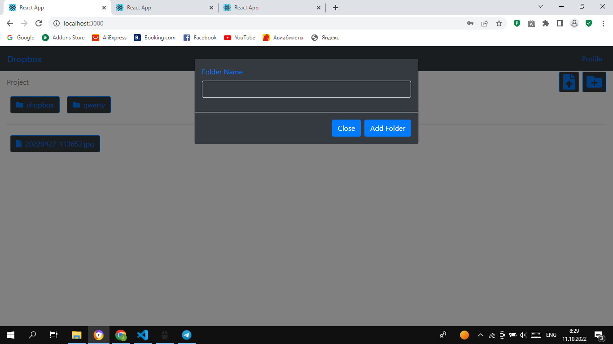
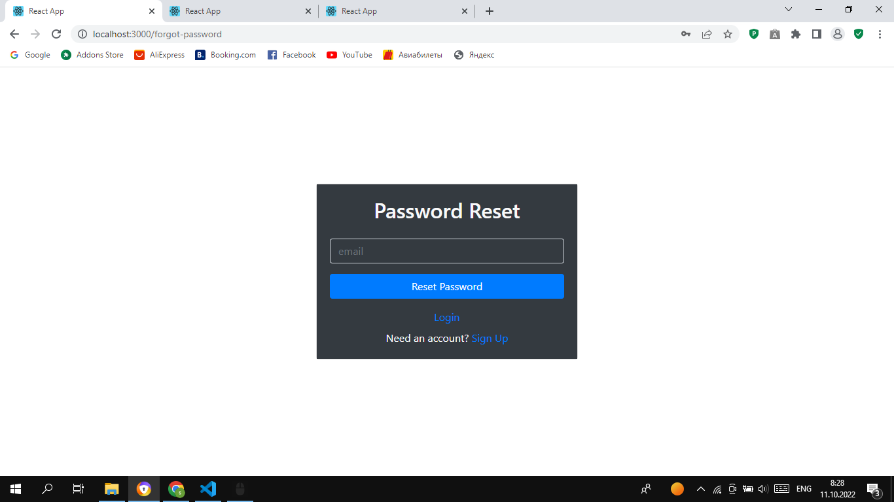
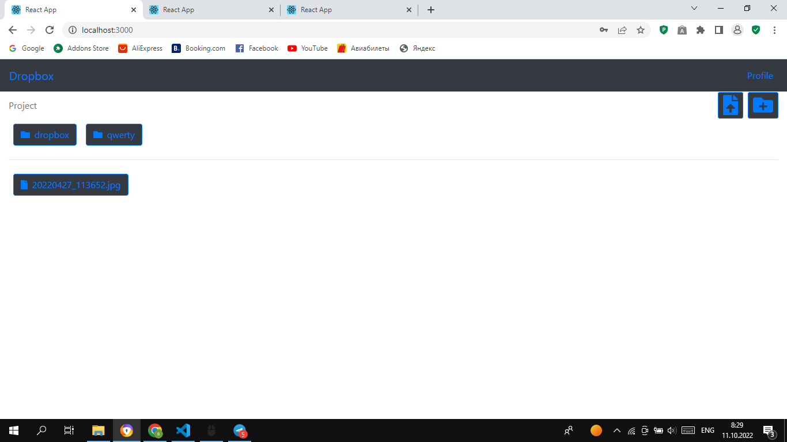

# Welcome Dropbox

<h3>Welcome to my project <a href="#">Dropbox</a></h3>

# Abilities 
<ul>
<li>Auth</li>
<li>Create Folder</li>
<li>Create File</li>
<li>Upload Files</li>
<li>View Profile</li>
<li>Edit Profile</li>
</ul>

# Dropbox images

This project was bootstrapped with [Create React App](https://github.com/facebook/create-react-app).
